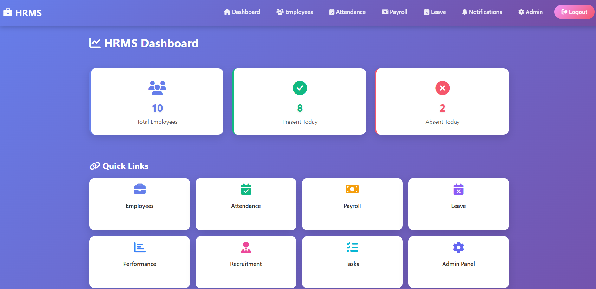
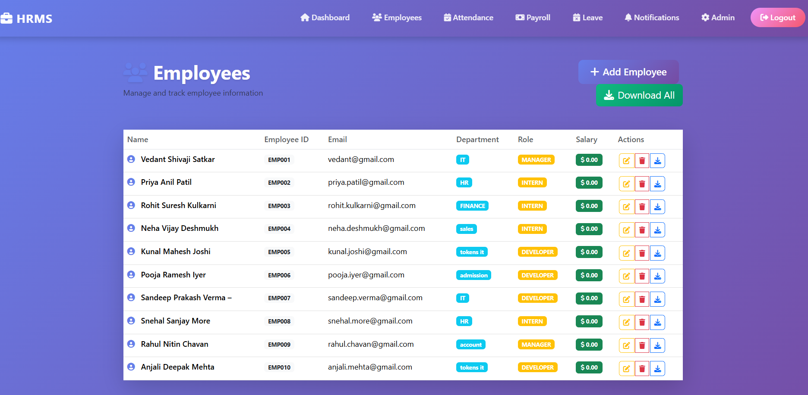
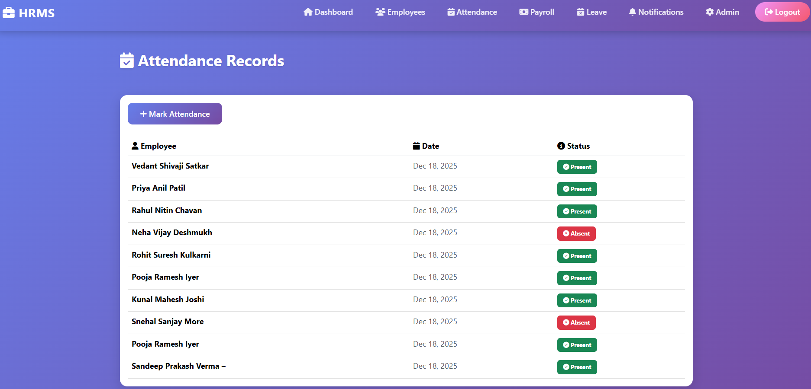
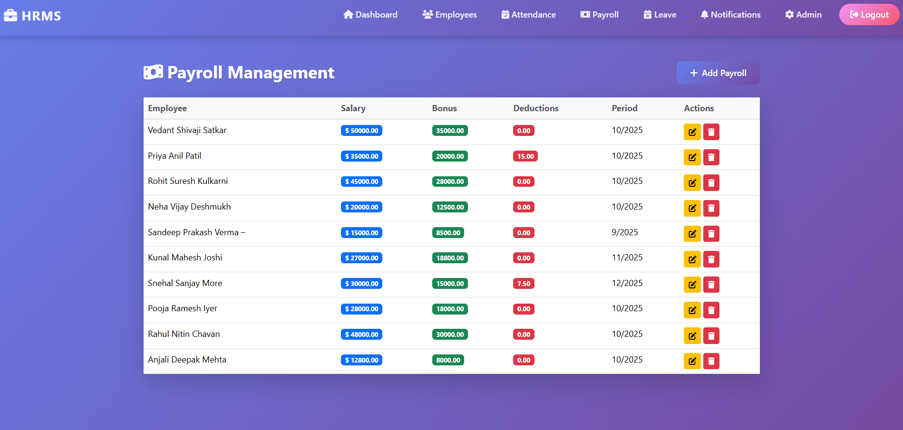

# 🧑‍💼 Human Resource Management System (HRMS)



A **full-stack web application** built using **Django** to manage an organization’s HR operations from one place.  
This project simulates real HR workflows — recruitment, attendance, payroll, leave, performance, and role-based access control — in a **professional dashboard interface**.

---

## 🚀 Overview

HRMS helps HR teams and employees interact with core HR functions through an intuitive dashboard.  
The system enforces strict role separation to prevent data leakage between admin and employee users.
It was built with **practical use, clean UI, secure access control**, and **real-world workflow logic** in mind — ideal for portfolios, interviews, and learning.

---

## 🎯 Features

### 🔐 Authentication & Access
- Role-Based Access Control (RBAC)
  - 👑 **Admin (HR/Manager):** Full control, approvals & backend operations
  - 👤 **Employee (User):** Personalized dashboard access
- Secure Django Authentication (no unauthorized access)

---

## 📦 Core Modules

### 👤 Employee Management
- Add / Edit / View employee profiles  
- Unique ID, department, role, salary, contact
---

### 🕒 Attendance Management
- Mark attendance (Present / Absent)
- Daily & historical records
- Integrated dashboard count
---

### 💰 Payroll Management
- Salary breakdown: Basic, Bonus, Deductions
- Automatic net salary calculation
- Monthly payslips
---

### 🗓 Leave Management
- Apply leave with date range & reason
- Admin approval workflow:

  ✔ Pending  
  ✔ Approved  
  ✖ Rejected
---

### 📋 Task & Performance
- Assign tasks with priority & status
- Performance reviews with ratings & feedback
---
### 🧑‍💼 Recruitment
- Track candidate applications
- View contact, applied position, status
---
### 📢 Notification System
- Admin-generated alerts
- Read / Unread tracking
---
### 📊 Central Dashboard
- Total Employees
- Present / Absent today
- Quick links to all modules

---

---

## 🖼 Screenshots

## 🖼 Screenshots

<table>
  <tr>
    <th>Dashboard</th>
    <th>Employees</th>
  </tr>
  <tr>
    <td>
      
    </td>
    <td>
      
    </td>
  </tr>
  <tr>
    <th>Attendance</th>
    <th>Payroll</th>
  </tr>
  <tr>
    <td>
      
    </td>
    <td>
      
    </td>
  </tr>
</table>


---

## 🛠 Tech Stack

| Feature | Tech |
|---------|------|
| Backend | Django (Python) |
| Frontend | HTML, CSS, Bootstrap |
| Database | SQLite (development) |
| Auth | Django Auth |
| Architecture | Django MVT pattern |

---

## ⚙️ Installation & Setup

Follow these steps to run locally:

```bash
# Clone
git clone https://github.com/your-username/hrms-project.git

# Enter folder
cd hrms-project

# Create virtual environment
python -m venv venv

# Activate
# Windows
venv\Scripts\activate
# Mac/Linux
source venv/bin/activate

# Install dependencies
pip install -r requirements.txt

# Apply migrations
python manage.py makemigrations
python manage.py migrate

# Create admin user
python manage.py createsuperuser

# Run server
python manage.py runserver
```
Visit ➤ http://127.0.0.1:8000/
---
### 🧠 Why I Built This

I developed this HRMS project to:

Practice end-to-end full-stack development

Understand real HR workflow automation

Implement secure authentication and role separation

Create a resume-worthy project that reflects production-style logic

---

### 📌 Use Case

✔ Portfolio showcase

✔ Django learning reference

✔ Small HR operations demo

✔ Interview project discussion

---

## 👨‍💻 Developed By:
 [Vedant Shivaji Satkar](https://github.com/VedantSatkar)
> **Aspiring Full-Stack & Backend Developer** 📍 Pune, India  
> 
>🔗 [**LinkedIn**](https://www.linkedin.com/in/vedant-satkar-731bb2298) 
> 💻 [**GitHub**](https://github.com/VedantSatkar) 
>🌐 [**Portfolio**](https://vedantsatkar.github.io/) 
>📧 [**Email**](mailto:vedantssatkar@gmail.com)

